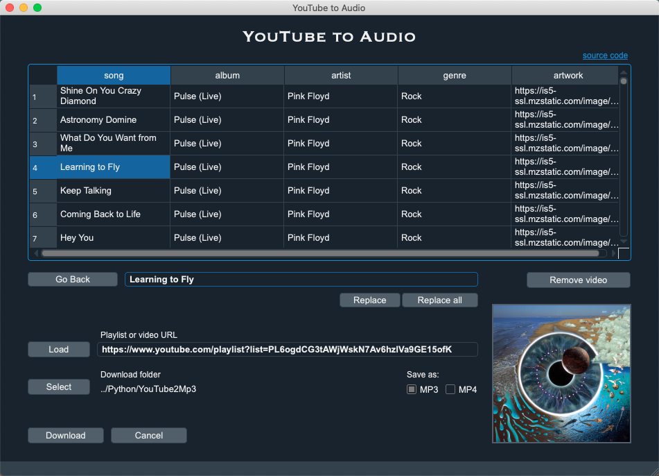

# **youtube2audio**


[](https://www.python.org/downloads/)
[](https://github.com/irahorecka/youtube2audio/actions)
[](https://raw.githubusercontent.com/irahorecka/youtube2audio/main/LICENSE)

A desktop application to download YouTube videos as annotated MP3 or MP4 files.
<br>
<br>

<hr>

## Using the application

Paste a YouTube playlist or video URL and load its content. Make edits to the table and click "Ask butler" (not shown in image above) to provide annotation hints to your videos. You can choose to download MP3 or MP4 files. Finally, select a download folder, download your videos, and just like that, you have nicely annotated audio files.

This application uses PyQt5 to provide the user interface and multithreading to execute calls asynchronously. The backend uses ```itunespy``` to suggest song annotations (i.e. "Ask butler"), ```pytube``` to download the YouTube video as an MP4 audio file, and FFmpeg to convert the MP4 file to MP3.

Watch the <a href="https://i.imgur.com/6gAdznH.mp4">video demo</a> for more information.
<hr>

## Running the application

1) Clone GitHub repository
2) ```pip install -r requirements.txt```
3) ```python main.py```

Check <b>Troubleshooting</b> if you encounter any trouble running / using the application or downloading MP3 files. If undocumented exceptions occur, please file the issue in <a href="https://github.com/irahorecka/YouTube2Audio/issues">issues</a>.
<hr>

## Troubleshooting

1) <a href="https://github.com/pytube/pytube">`pytube`</a> is constantly upgrading to maintain compliance with YouTube's API. If you find exception messages on your terminal console during download, separately install the following `pytube` version as follows:

    ```pip install git+https://github.com/irahorecka/pytube.git@a32fff3```

2) If the script completes instantly without downloading your video(s), you're probably experiencing an ```SSL: CERTIFICATE_VERIFY_FAIL``` exception. This fails to instantiate ```pytube.Youtube```, thus failing the download prematurely.

    To troubleshoot this (if you're using macOS), go to Macintosh HD > Applications > Python3.7 folder (or whatever version of python you're using) > double click on ```Install Certificates.command``` file. This should do the trick.
